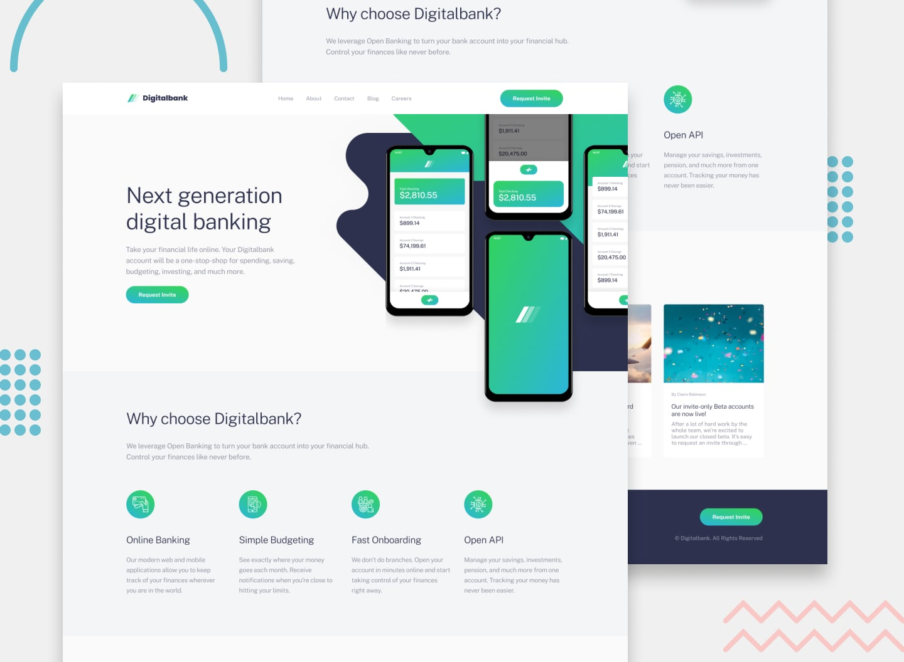

# Frontend Mentor - Digitalbank landing page

[Frontend Mentor Challenge](https://www.frontendmentor.io/challenges/digital-bank-landing-page-WaUhkoDN)

> Use Tailwind to implement the design accurately

### Reflection Questions
##### Challenges you encountered during the project.
> I found it a little hard to understand how to use some of the tailwind class. Because tailwind has it own default styles, I wanted to see how to do things with pure css first.
##### Your approach to solving these challenges.
> I coded the design in css then converted to tailwind. I learned more about tailwind defaults styles to be able to complete the design.
##### Improvements you would make if given more time.
> I would like to have made mutiple pages for the website like a real website

---

## Overview

### The challenge

Users should be able to:

- View the optimal layout for the site depending on their device's screen size
- See hover states for all interactive elements on the page
